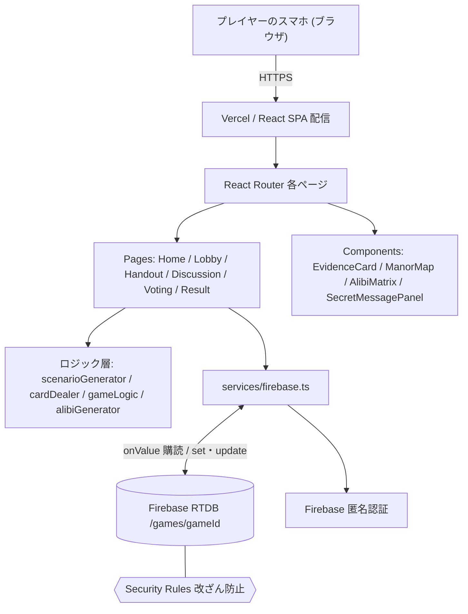
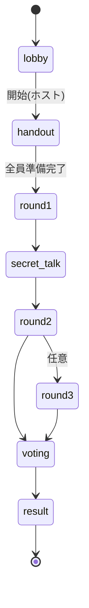
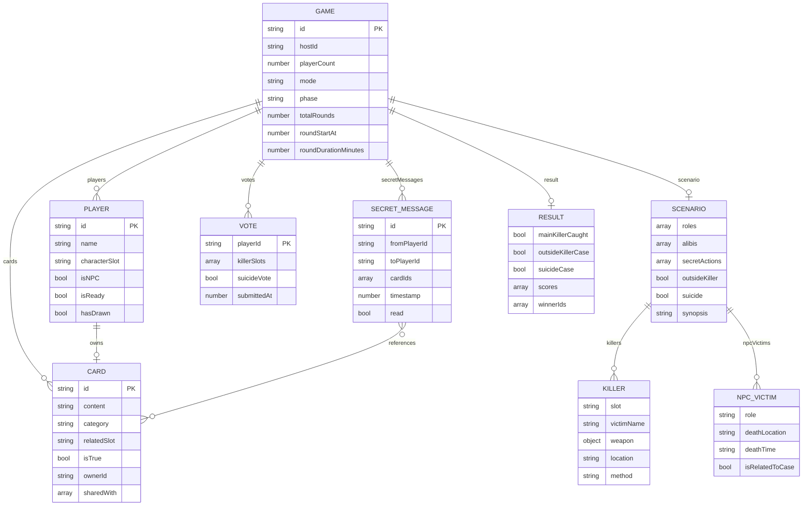

# 紫苑館の秘密 — 設計ドキュメント

リアルタイム同期型マーダーミステリー Web アプリの要件定義・基本設計・詳細設計、およびアーキテクチャ／データモデル図。

**技術スタック**: Vite + React + TypeScript / Tailwind CSS v4 / Firebase Realtime Database / Vercel

---

## 1. システム概要

各プレイヤーが自分のスマートフォンのブラウザから同一ゲームに接続し、リアルタイムに同期しながら進行する会話型推理ゲーム。サーバーレス構成で、状態管理はすべて **Firebase Realtime Database（RTDB）** の「1 ゲーム 1 ツリー」に集約する。ホスト（GM）がフェーズ遷移を制御し、シナリオ・カードは開始時に自動生成される。

- **クライアント**: React SPA（静的ホスティング）。サーバーサイドロジックは持たない。
- **状態同期**: RTDB の `onValue` 購読で全端末へプッシュ配信。
- **認証**: Firebase 匿名認証。`uid` を URL クエリで各画面に引き回す。
- **生成**: シナリオ・役割・カードはゲーム開始時にクライアント（ホスト端末）で生成し RTDB に書き込む。

---

## 2. 要件定義書

### 機能要件

| ID | 要件 | 概要 |
|----|------|------|
| FR-01 | ロビー／部屋管理 | ホストが部屋を作成し人数・モード・タイマー・ラウンド数を設定。参加者は URL で入室し名前を登録する。 |
| FR-02 | 役割・キャラ割当 | 開始時に A〜G の枠をシャッフルして割当。不足分は NPC を自動補充。 |
| FR-03 | シナリオ生成 | 被害者・犯人・凶器・場所・アリバイ・関係・NPC 死亡を自動生成。単独/複数/二重犯行/共謀連鎖/外部犯/自殺を確率的に選択。 |
| FR-04 | カード配布 | 7 カテゴリのカードを手札(各 5 枚)＋山札(20〜30 枚)として配布。真偽・関連キャラ・ミスリードを設定。 |
| FR-05 | ハンドアウト | 共通情報 → 個別情報の順に表示。個別は「他言無用」の確認を挟む。 |
| FR-06 | 討議・密談 | 全体討議とタイマー、山札公開、個人ドロー、1 対 1 の密談（カード送信）。 |
| FR-07 | 投票・採点 | 犯人指名／外部犯／自殺の一斉投票。基本点・立ち回り点・完全告発・パズル一致で採点。 |
| FR-08 | 真相公開 | 正解・全カードの真偽（真実／ミスリード）・得点・勝者を開示。 |
| FR-09 | 館内図・プロフィール | 3 階層マップ（死亡者ピン付き）と、討議中も参照できる自分＋共通情報のプロフィール表示。 |
| FR-10 | デバッグモード | 人数 < 4 で 1 人が全枠を切替閲覧して動作確認できる。 |

### 非機能要件

| ID | 分類 | 内容 |
|----|------|------|
| NFR-01 | UX | モバイルファースト。相対単位とブレークポイントで横スクロールを出さない。 |
| NFR-02 | 同期性 | フェーズ・カード公開・投票が全端末へ即時反映される。 |
| NFR-03 | 堅牢性 | RTDB が空配列を `null` で返す挙動に対し全アクセスで null 安全化。 |
| NFR-04 | 公平性 | Fisher–Yates による偏りのない役割割当。 |
| NFR-05 | セキュリティ | RTDB Security Rules で改ざん防止。API キー等の秘匿情報はリポジトリに含めない（`.env`）。 |
| NFR-06 | ネタバレ防止 | 共通画面に死因や偽装を出さず、真偽はゲーム中非表示。秘密通路・隠し部屋は地図に載せずカードで開示。 |

---

## 3. アーキテクチャ図

クライアント完結型。ロジックはホスト端末で実行し、結果を RTDB に書き込んで全端末へ同期する。

---

## 4. 基本設計

### 画面一覧と遷移

| 画面 | ルート | 役割 |
|------|--------|------|
| Home | `/` | 部屋作成・参加の入口 |
| Lobby | `/lobby/:id` | 参加者待機・設定・ゲーム開始 |
| Handout | `/handout/:id` | 共通情報 → 個別情報の確認、準備完了 |
| Discussion | `/game/:id` | 討議・密談・山札・プロフィール・マップ |
| Voting | `/vote/:id` | 一斉投票 |
| Result | `/result/:id` | 真相・真偽・得点・勝者 |

### フェーズ状態遷移

遷移はホストの操作でのみ進む。各端末は `phase` の変化を購読して対応する画面へ自動遷移する。

### モジュール責務

- **scenarioGenerator**: 事件パターンの抽選と、役割・凶器・アリバイ・関係・NPC 死亡・あらすじの生成。
- **alibiGenerator**: 各枠の T1/T2/T3 の在室場所（T2 は秘密行動の場所固定）を生成。
- **cardDealer**: テンプレート＋動的カード（検死所見・秘密通路発見・NPC 証言）から真偽を解決し配札。
- **gameLogic**: 投票集計と採点（勝敗判定）。
- **services/firebase**: RTDB への読み書きと購読。`firebase.mock.ts` でローカル検証。

---

## 5. 詳細設計

### 役割割当（Fisher–Yates）

枠配列を Fisher–Yates で完全シャッフルし、参加者へ順に割当。`.sort(() => Math.random() - 0.5)` は偏るため不可。

### シナリオ抽選

- 非パズル時、`[1人犯人, …, n-1人犯人, 外部犯]` から均等確率で抽選。別途一定確率で **自殺** を選択。
- 複数犯人時は確率で **二重犯行**（7 パターン）を発生させ、同一被害者に二つの殺意を交差させる。
- **外部犯**: `killers = []`、`outsideKiller = true`。全プレイヤー無実。
- **自殺**: `suicide = true`。あらすじにランダムなプレイヤーを疑わせるミスリード（30 種）を 1 つ挿入。

### カードの真偽解決

- テンプレートの `condition`（suicide / outsideKiller / 犯行場所 / 凶器一致）で `isTrue` を確定。
- **検死所見カード**: 他殺 NPC は不審な所見（真の手がかり）、自然死 NPC は矛盾なしの所見。
- **秘密通路発見カード**: どこからどこへ通じるかを示す発見型ヒントを毎回 3 枚配布。
- ミスリード札は「見間違い」等の断り書きを付けず、確信的な証言として提示（真偽はゲーム中非表示）。

### 採点ロジック（gameLogic）

| 要素 | 内容 |
|------|------|
| 基本点 | 無実: 真相的中で +5／部分正解で捕捉数分。犯人: 逃げ切りで +5、捕まると 0。外部犯・自殺は「該当票が過半数」で無実側 +5。 |
| 立ち回り +2 | 秘密行動を持ちつつ、自分の関連カードが全体公開されず切り抜けた場合。 |
| パズル +10 | パズルモードで犯人 → 被害者の対応を完全一致で当てた場合。 |
| 勝者 | 合計点が最大のプレイヤー（複数可）。 |

犯人の集計は非パズル時、犯人自身の票を除いた「無実者の総意」で過半数判定する。

### 堅牢性・セキュリティ

- RTDB は空配列を `null` で返すため、`sharedWith`・`killers`・`npcVictims` 等へのアクセスは全て `?? []` で null 安全化。
- 書き込み前に `scenario` の `undefined` を JSON ラウンドトリップで除去（RTDB は undefined を拒否）。
- Security Rules で hostId 以外のフェーズ改変・他人の `isReady`/`hasDrawn` 改ざんを防止。

---

## 6. データモデル（ER 図）

RTDB は JSON ツリー。以下は `/games/{gameId}` 配下の構造を ER 図として近似したもの（実体は入れ子オブジェクト）。

`PK` は RTDB 上ではオブジェクトのキー（プッシュ ID / uid / gameId）に対応する。

---

## 7. 技術スタック・デプロイ

- **フロント**: Vite / React / TypeScript / Tailwind CSS v4 / React Router。
- **バックエンド**: Firebase Realtime Database（サーバーレス）＋匿名認証。
- **ホスティング**: Vercel（`main` ブランチのプッシュで自動デプロイ）。SPA リライト設定あり。
- **設定**: Firebase 資格情報は `VITE_FIREBASE_*` 環境変数。`.env` は非コミット。
- **検証**: `npm run build`（`tsc -b` ＋ Vite）で型・ビルド確認。mock サービスでローカル通し確認。
